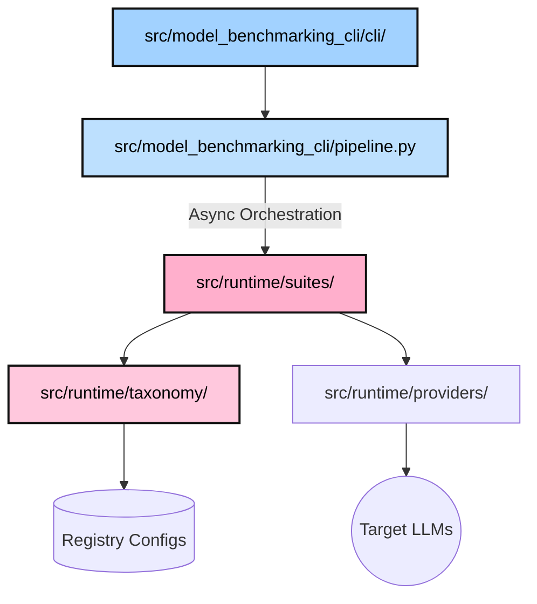

# 🌌 Model Benchmarking

[](LICENSE)
[](https://www.python.org/downloads/)
[](AGENTS.md)
[]()

> **A cybersecurity benchmarking framework for model evaluation.**
> The repository provides a taxonomy-aligned evaluation pipeline, adapter-based suite orchestration, and a compatibility layer for the current public API.

---

## Engineering Overview

This repository separates the public CLI and compatibility wrappers from the core runtime:
1. **CLI boundary**: `src/model_benchmarking_cli/` contains the public command surface and adapter wiring.
2. **Runtime core**: `src/runtime/` holds providers, suites, taxonomy, and evaluation logic.
3. **Compatibility layer**: `src/mcp/` remains as a transitional import surface for existing callers and tests.
4. **Repo guidance**: `.agents/` contains workflow and steering notes for contributors and agents.

---

## 🚀 Quick Start

### 1️⃣ Installation

```bash
# Clone and setup environment
git clone https://github.com/bannff/model-benchmarking.git
cd model-benchmarking
python3 -m venv .venv && source .venv/bin/activate

# Install with robust development and testing tools
pip install -e "."
```

### 2️⃣ Run Your First Eval

```bash
# Execute a mathematically-pure pipeline dry-run relying on the mock provider
mbenchmark pipeline --dry-run
```

---

## 🏗️ Architecture

The repository evaluates targets by fusing dynamic benchmarking environments with an exhaustive cybersecurity dataset schema.



---

## 📊 Benchmark Suites

### 📝 CS-Eval (Security Knowledge)
Comprehensive Q&A benchmarks testing theoretical foundations and security reasoning.  
`mbenchmark run --suite cs-eval`

### 🐛 CVE-Bench (Exploit Dev)
Real-world vulnerability exploitation challenges in isolated container environments.  
`mbenchmark run --suite cve-bench`

### 🏟️ CyberGym (Interactive Scenarios)
Multi-step, interactive security missions testing agentic decision-making.  
`mbenchmark run --suite cybergym`

---

## 🧭 Navigation

- 🛠 **[CLI Reference](docs/cli.md)** — Master the `mbenchmark` command.
- 📂 **[Taxonomy Protocol](src/runtime/taxonomy/)** — Explore the built-in security hierarchy and dynamic YAML mappers.
- 🤖 **[Agent Onboarding](AGENTS.md)** — Core setup guide for integrated AI collaborators.
- 🧭 **[Steering Documentation](.agents/README.md)** — Advanced agent blueprints, skills, and `<200 LOC` refactoring recipes.

---

## 🛡 Safety & Disclosure

This repository contains **intentionally vulnerable code** and exploit patterns for research and evaluation purposes.  
**NEVER** run these benchmarks against production systems. Always use the provided Docker isolation primitives.

---

## 📜 License

This project is licensed under the **Business Source License 1.1**. See [LICENSE](LICENSE) for the full text.  
*Model-Benchmarking by Bannff.*
