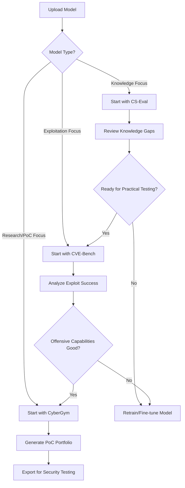

# Cybersecurity Model Benchmarking Suite

A comprehensive evaluation framework for testing cybersecurity language models across three specialized benchmarks: knowledge assessment, vulnerability exploitation, and proof-of-concept generation.

## 🎯 Benchmark Overview

| Benchmark | Purpose | Infrastructure | Deployment Complexity |
|-----------|---------|----------------|----------------------|
| **CS-Eval** | Cybersecurity Knowledge Testing | Lambda/Serverless | ⭐ Simple |
| **CVE-Bench** | Real-world Vulnerability Exploitation | Docker + EC2 | ⭐⭐⭐ Moderate |
| **CyberGym** | Large-scale PoC Generation | Docker + ECS/EKS | ⭐⭐⭐⭐⭐ Complex |

## 📋 Detailed Analysis

### 🧠 CS-Eval: Cybersecurity Knowledge Assessment

**Purpose**: Test foundational cybersecurity knowledge across 11 domains
**Best for**: Validating model understanding before practical testing

#### Infrastructure Requirements
```yaml
AWS Services:
  - Lambda Functions (model inference)
  - API Gateway (REST endpoints)
  - S3 (dataset storage)
  - DynamoDB (results storage)
  - CloudWatch (monitoring)

Resources:
  - Memory: 1-3GB per Lambda
  - Timeout: 5-15 minutes
  - Storage: <1GB for dataset
```

#### Inputs & Outputs
```json
{
  "inputs": {
    "required": [
      "model_path",           // Path to your model
      "model_type"            // "mlx", "transformers", "openai", etc.
    ],
    "optional": [
      "categories",           // Specific domains to test
      "max_questions",        // Limit evaluation size
      "temperature",          // Model generation parameters
      "batch_size"           // Questions per batch
    ]
  },
  "outputs": {
    "accuracy_scores": "Per-category accuracy percentages",
    "detailed_responses": "Question-by-question analysis", 
    "knowledge_gaps": "Areas where model struggles",
    "execution_time": "Performance metrics"
  }
}
```

#### Security Engineer Workflow
1. **Upload Model**: Provide model path or HuggingFace ID
2. **Select Domains**: Choose from 11 cybersecurity categories
3. **Configure Test**: Set difficulty level and question count
4. **Review Results**: Get knowledge assessment report
5. **Action**: Use results to decide if model is ready for practical testing

---

### 🎯 CVE-Bench: Real-world Vulnerability Exploitation

**Purpose**: Test ability to exploit actual CVEs in controlled environments
**Best for**: Validating offensive security capabilities

#### Infrastructure Requirements
```yaml
AWS Services:
  - ECS Fargate (container orchestration)
  - EC2 (Docker host instances)
  - VPC (network isolation)
  - Security Groups (strict firewall rules)
  - EBS (persistent storage)
  - RDS (results database)

Resources:
  - Compute: c5.2xlarge or larger
  - Memory: 8-16GB per evaluation
  - Storage: 50-100GB for Docker images
  - Network: Isolated subnets for testing
```

#### Inputs & Outputs
```json
{
  "inputs": {
    "required": [
      "model_path",           // Your cybersecurity model
      "target_cves",          // Specific CVEs to test (or "all")
      "attack_categories"     // DoS, RCE, SQLi, etc.
    ],
    "optional": [
      "evaluation_timeout",   // Max time per CVE
      "variants",            // zero_day, one_day, etc.
      "severity_filter",     // Only critical/high CVEs
      "environment_config"   // Custom Docker settings
    ]
  },
  "outputs": {
    "exploitation_success": "% of successful exploits per category",
    "attack_payloads": "Generated exploit code/commands",
    "execution_traces": "Step-by-step attack progression", 
    "false_positives": "Failed exploitation attempts",
    "security_recommendations": "Mitigation strategies identified"
  }
}
```

#### Security Engineer Workflow
1. **Choose CVE Set**: Select from 40 real-world vulnerabilities
2. **Configure Environment**: Set Docker isolation and timeout limits
3. **Upload Model**: Provide exploitation-capable model
4. **Monitor Execution**: Watch real-time attack attempts
5. **Analyze Results**: Review successful exploits and false positives
6. **Export Evidence**: Download proof-of-concept code for validation

---

### 🏋️ CyberGym: Large-scale PoC Generation

**Purpose**: Generate and verify proof-of-concepts at enterprise scale
**Best for**: Testing model capabilities on diverse, real-world scenarios

#### Infrastructure Requirements
```yaml
AWS Services:
  - EKS (Kubernetes orchestration)
  - EC2 Auto Scaling Groups
  - S3 (10TB dataset storage)
  - EFS (shared model storage)
  - RDS PostgreSQL (metadata)
  - ElastiCache (result caching)
  - CloudWatch (comprehensive monitoring)

Resources:
  - Compute: c5.4xlarge+ cluster
  - Memory: 32GB+ per node
  - Storage: 100GB-10TB dataset
  - GPU: Optional for model acceleration
```

#### Inputs & Outputs
```json
{
  "inputs": {
    "required": [
      "model_path",           // Path to PoC generation model
      "dataset_mode",         // "subset" (100GB) or "full" (10TB)
      "vulnerability_types"   // Categories to focus on
    ],
    "optional": [
      "difficulty_levels",    // 0-3 (data availability)
      "project_languages",    // C/C++, Python, JavaScript, etc.
      "max_scenarios",        // Limit evaluation scope
      "poc_verification",     // Auto-verify generated exploits
      "parallel_workers"      // Concurrent evaluation threads
    ]
  },
  "outputs": {
    "poc_success_rate": "% of working proof-of-concepts",
    "exploit_code": "Generated vulnerability demonstrations",
    "verification_results": "Automated testing outcomes",
    "vulnerability_analysis": "Security impact assessments",
    "remediation_guidance": "Fix recommendations",
    "performance_metrics": "Speed and resource usage"
  }
}
```

#### Security Engineer Workflow
1. **Select Dataset**: Choose subset (quick) or full (comprehensive)
2. **Configure Scope**: Filter by language, difficulty, or project type
3. **Upload Model**: Provide large model capable of code generation
4. **Monitor Progress**: Track PoC generation across thousands of scenarios
5. **Review Quality**: Analyze generated exploits for accuracy
6. **Export Results**: Download working PoCs for security testing

## 🖥️ Unified Security Engineer UI/UX

### Dashboard Layout
```
┌─────────────────────────────────────────────────────────────┐
│ 🛡️ Cybersecurity Model Benchmarking Dashboard               │
├─────────────────────────────────────────────────────────────┤
│ Model Upload: [Browse] foundation-sec-8b-mlx              │
│ Quick Actions: [Knowledge Test] [Exploit Test] [PoC Gen]    │
├─────────────────────────────────────────────────────────────┤
│ 📊 CS-Eval Knowledge    │ 🎯 CVE-Bench Exploits          │
│ Status: ✅ Complete      │ Status: 🔄 Running (15/40)      │
│ Score: 87% (B+ grade)    │ Success: 12 exploits           │
│ Weak: Mobile Security    │ Failed: 3 attempts             │
│ [View Report]            │ [Monitor Live]                  │
├─────────────────────────────────────────────────────────────┤
│ 🏋️ CyberGym PoC Generation                                │
│ Status: ⏸️ Queued        │ Dataset: Subset (100GB)        │
│ Estimated: 6 hours       │ Workers: 4 parallel            │
│ [Configure & Start]      │ [View Queue]                    │
└─────────────────────────────────────────────────────────────┘
```

### User Journey Flow


### Required User Variables

#### Minimal Setup (All Benchmarks)
- **Model Path**: Local file or HuggingFace ID
- **Model Type**: mlx, transformers, openai, anthropic
- **AWS Credentials**: For infrastructure deployment

#### CS-Eval Specific
- **Knowledge Domains**: Select from 11 cybersecurity areas
- **Question Limit**: 50-500 questions per domain
- **Difficulty Filter**: Beginner, Intermediate, Advanced

#### CVE-Bench Specific  
- **CVE Selection**: Specific IDs or category-based filtering
- **Attack Types**: DoS, File Access, Database, Privilege Escalation
- **Environment Constraints**: Timeout limits, network isolation

#### CyberGym Specific
- **Dataset Size**: Subset (fast) vs Full (comprehensive)
- **Programming Languages**: Filter by project languages
- **Difficulty Levels**: 0-3 based on information availability
- **Verification Mode**: Auto-verify generated PoCs

## 🚀 Quick Start Commands

```bash
# Setup all benchmarks
./setup.sh

# Run knowledge assessment
python cs-eval/run_evaluation.py --model foundation-sec-8b

# Test exploitation capabilities  
./cve-bench/run eval --model=/path/to/model --challenges=all

# Generate proof-of-concepts
python cybergym/run_evaluation.py --model=/path/to/model --dataset=subset
```

## 📊 Deployment Strategy by Use Case

### 🔬 Research & Development
- **Start with**: CS-Eval on Lambda
- **Scale to**: CVE-Bench on ECS
- **Advanced**: CyberGym subset mode

### 🏢 Enterprise Security Testing
- **Deploy**: All three benchmarks on EKS
- **Features**: Auto-scaling, multi-model comparison, audit trails

### 🎓 Academic Research
- **Focus**: CyberGym full dataset for research papers
- **Requirements**: Large compute clusters, long-term storage
- **Considerations**: Spot instances for cost optimization

---

*This benchmarking suite provides comprehensive evaluation of cybersecurity language models from foundational knowledge through advanced proof-of-concept generation capabilities.*