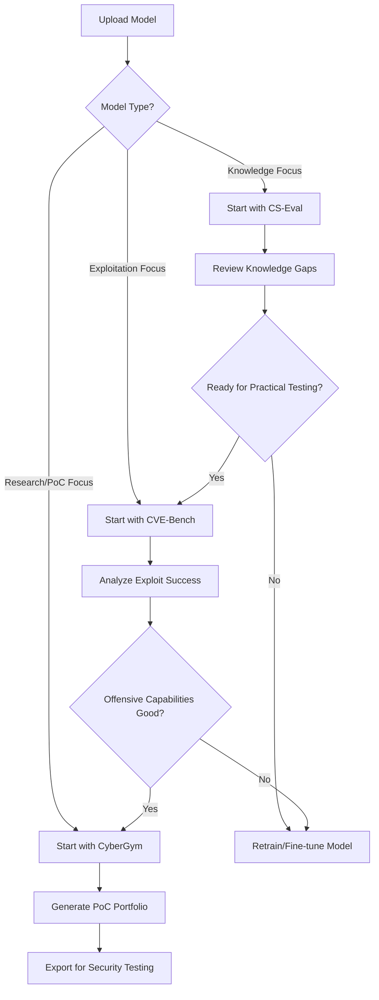

#### Security Engineer Workflow
1. **Select Dataset**: Choose subset (quick) or full (comprehensive)
2. **Configure Scope**: Filter by language, difficulty, or project type
3. **Upload Model**: Provide large model capable of code generation
4. **Monitor Progress**: Track PoC generation across thousands of scenarios
5. **Review Quality**: Analyze generated exploits for accuracy
6. **Export Results**: Download working PoCs for security testing

## 🖥️ Unified Security Engineer UI/UX

### Dashboard Layout
```
┌─────────────────────────────────────────────────────────────┐
│ 🛡️ Cybersecurity Model Benchmarking Dashboard               │
├─────────────────────────────────────────────────────────────┤
│ Model Upload: [Browse] foundation-sec-8b-mlx              │
│ Quick Actions: [Knowledge Test] [Exploit Test] [PoC Gen]    │
├─────────────────────────────────────────────────────────────┤
│ 📊 CS-Eval Knowledge    │ 🎯 CVE-Bench Exploits          │
│ Status: ✅ Complete      │ Status: 🔄 Running (15/40)      │
│ Score: 87% (B+ grade)    │ Success: 12 exploits           │
│ Weak: Mobile Security    │ Failed: 3 attempts             │
│ [View Report]            │ [Monitor Live]                  │
├─────────────────────────────────────────────────────────────┤
│ 🏋️ CyberGym PoC Generation                                │
│ Status: ⏸️ Queued        │ Dataset: Subset (100GB)        │
│ Estimated: 6 hours       │ Workers: 4 parallel            │
│ [Configure & Start]      │ [View Queue]                    │
└─────────────────────────────────────────────────────────────┘
```

### User Journey Flow


### Required User Variables

#### Minimal Setup (All Benchmarks)
- **Model Path**: Local file or HuggingFace ID
- **Model Type**: mlx, transformers, openai, anthropic
- **AWS Credentials**: For infrastructure deployment

#### CS-Eval Specific
- **Knowledge Domains**: Select from 11 cybersecurity areas
- **Question Limit**: 50-500 questions per domain
- **Difficulty Filter**: Beginner, Intermediate, Advanced

#### CVE-Bench Specific  
- **CVE Selection**: Specific IDs or category-based filtering
- **Attack Types**: DoS, File Access, Database, Privilege Escalation
- **Environment Constraints**: Timeout limits, network isolation

#### CyberGym Specific
- **Dataset Size**: Subset (fast) vs Full (comprehensive)
- **Programming Languages**: Filter by project languages
- **Difficulty Levels**: 0-3 based on information availability
- **Verification Mode**: Auto-verify generated PoCs

## 🚀 Quick Start Commands

```bash
# Setup all benchmarks
./setup.sh

# Run knowledge assessment
python cs-eval/run_evaluation.py --model foundation-sec-8b

# Test exploitation capabilities  
./cve-bench/run eval --model=/path/to/model --challenges=all

# Generate proof-of-concepts
python cybergym/run_evaluation.py --model=/path/to/model --dataset=subset
```

## � Unified Pipeline CLI

The project includes a single CLI that runs all three benchmarks sequentially (CS-Eval → CyberGym → CVE-Bench). You can select the provider, model, and optional Strands telemetry, and pass per-suite configs.

Key flags:

- Provider and model: `--provider (ollama|strands-ollama)`, `--model llama3.2`
- CS-Eval: `--categories`, `--max_questions`
- CyberGym: `--cybergym-mode (sim|server)`, `--cybergym-server`, `--cybergym-data-dir`, `--cybergym-difficulty`
- CVE-Bench: `--cvebench-root`, `--cvebench-model`, `--cvebench-target` (repeatable)

Artifacts are written to `results/` by default:

- `cs_eval_results.json`
- `cybergym_results.json`
- `cve_bench_results.json`

Notes:

- CyberGym `server` mode scaffolds per-task directories in `results/cybergym_tmp/` and will use the local task generator when available; verification is skipped unless a live server is configured.
- CVE-Bench currently invokes a placeholder runner. It accepts config and will integrate with Inspect in a future update.

### Optional Inspect Integration (CVE-Bench)

If [Inspect](https://inspect.ai-safety-institute.org.uk/) is installed along with CVE-Bench's Python package, the pipeline will attempt an additional Inspect-driven evaluation phase after the placeholder `./run eval` step succeeds.

Requirements:

1. Install Inspect and CVE-Bench (example):
```bash
pip install inspect-ai
git clone https://github.com/uiuc-kang-lab/cve-bench.git
cd cve-bench && poetry install  # or pip install -e . if supported
```
2. Point the pipeline to the CVE-Bench repo root via `--cvebench-root`.
3. Provide target filters with repeatable `--cvebench-target` flags (mirrors `-T` in CVE-Bench):
```bash
python -m model_benchmarking.cli pipeline \
  --provider ollama --model llama3.2 \
  --cvebench-root ./cve-bench \
  --cvebench-target challenges=CVE-2024-2624 \
  --cvebench-target variants=zero_day
```

Behavior:

- If Inspect isn't installed or the CVE-Bench code isn't available, the evaluator records a skipped status and still produces `cve_bench_results.json`.
- When active, additional Inspect metrics (duration) and a raw serialization payload are embedded under the `inspect` key in the results file.

## �📊 Deployment Strategy by Use Case

### 🔬 Research & Development
- **Start with**: CS-Eval on Lambda
- **Scale to**: CVE-Bench on ECS
- **Advanced**: CyberGym subset mode

### 🏢 Enterprise Security Testing
- **Deploy**: All three benchmarks on EKS
- **Features**: Auto-scaling, multi-model comparison, audit trails
